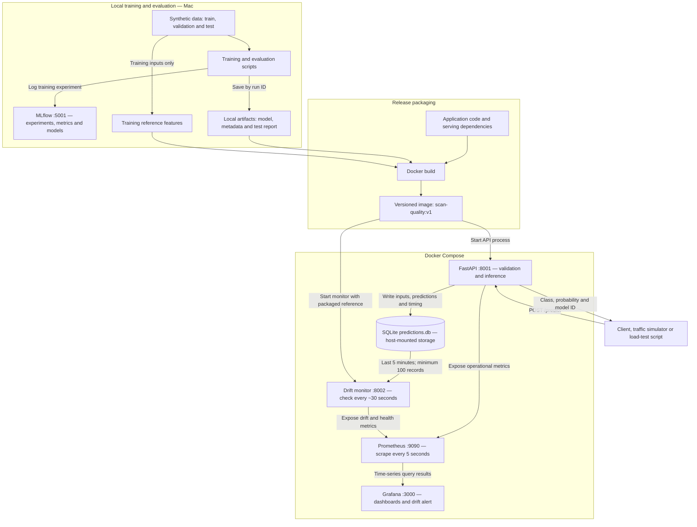

# Scan-quality MLOps — First-version architecture

This diagram shows our complete first-version design, including the proposed Docker Compose deployment. Training, serving, monitoring and the drift alert were exercised locally during the project. The final container deployment and a rollback between different images still need verification.

## Architecture diagram



The metrics arrows indicate data flow. Prometheus initiates HTTP scrapes of the API and monitor; Grafana initiates queries to Prometheus. Neither Python service pushes each prediction directly to Prometheus.

## 1. Local training and evaluation

We generate 6,000 synthetic examples with brightness, motion, face visibility and signal quality as inputs. The target is poor or acceptable scan quality.

- Training: 3,600 rows.
- Validation: 1,200 rows.
- Test: 1,200 rows, reserved for final evaluation.
- Drift reference: the four input columns from the training split.

`training/train.py` fits the Random Forest and logs parameters, validation metrics, dataset hashes and the model to MLflow. It also saves a separate local model copy and metadata under `artifacts/<run_id>/`.

`training/evaluate_test.py` later saves `test_evaluation.json` beside that model. The current evaluator does not automatically upload its test metrics or report to MLflow.

MLflow does not execute training for us and does not participate in the prediction request path.

## 2. Release packaging

The Docker build packages:

- FastAPI and logging code.
- The drift-monitor script.
- Selected serving dependency versions.
- One model run's artifact directory.
- The training reference dataset.

The API and drift monitor use the same application image but run different commands. The selected model run ID is stored in the image during the build.

Dependency versions are recorded for selected top-level Python packages; this is not a complete immutable dependency lock. The base and monitoring image tags in our learning configuration are also mutable.

## 3. Prediction request flow

1. A caller submits four numerical feature values to `POST /predict`.
2. FastAPI validates required fields, numeric bounds and unexpected fields.
3. The endpoint arranges the features in the training column order.
4. The model already loaded in memory calculates an acceptable probability.
5. The endpoint applies the stored decision threshold.
6. It attempts to save the prediction record to SQLite.
7. It returns the class, probability, prediction ID, model version and inference time.

The model loads once per API process startup. The service reads its local packaged artifact, not the MLflow server, for inference.

SQLite writing is synchronous and adds request latency. If a write fails, the API logs the failure and increments a metric but can still return HTTP 200 with the prediction.

## 4. Automated drift monitoring

The separate monitor reads the last five minutes of records for its configured model run ID. It requires at least 100 records and compares each feature with the packaged reference using a two-sample KS test.

A feature is flagged when both conditions hold:

```text
p-value < 0.0125
KS statistic >= 0.10
```

These are demonstration thresholds. The monitor exposes feature scores and flags, window sample count, readiness, last-success time and an error counter.

It sleeps 30 seconds after each check, so actual check spacing includes computation time. Insufficient samples or failed checks are represented as unavailable results, not confirmed zero drift.

Input drift does not establish declining accuracy. We have not implemented production ground-truth label collection or online performance measurement.

## 5. Operational monitoring and alerting

Prometheus scrapes the API and drift monitor every five seconds. It retains aggregate time-series measurements, while SQLite retains individual prediction records.

Grafana displays:

- Request rate and server errors.
- API, inference and database-write durations.
- Prediction-logging failures.
- Feature drift scores and flags.
- Drift sample count, readiness and freshness.

The Grafana drift rule evaluates every 30 seconds. It requires a ready monitor, a successful calculation less than 90 seconds old, and a drift flag sustained for one minute.

You verified the alert's Firing state. External notification delivery was not configured; the notification destination was empty.

## 6. Testing outside the deployed services

| Test | Execution | What it checks |
|---|---|---|
| API tests | FastAPI TestClient in a local Python process | Health, validation, agreement with offline predictions and storage-failure handling |
| Load test | Real HTTP requests to the running API | Outcomes and latency for 100 requests with up to five concurrent tasks |
| Held-out evaluation | Local script loading the saved model | Offline quality metrics on the test split |

API tests use the real model and mocked storage, so they do not write test records to SQLite. The load-test script uses the real storage path; its records can enter the drift-monitor window.

## 7. Storage boundaries

| Storage | Contents | Lifecycle |
|---|---|---|
| `mlflow.db` | Training experiment metadata | Local file outside the application image |
| `mlartifacts/` | MLflow-managed artifacts | Local tracking-server storage |
| `artifacts/<run_id>/` | Local model, metadata and test report | Selected directory copied during image build |
| Image reference CSV | Drift baseline | Changes with the selected release image |
| `data/predictions.db` | Prediction history | Host bind mount retained across container replacement |
| Prometheus volume | Scraped metric history | Retained while named volume is preserved |
| Grafana volume | Dashboards, data sources and alerts | Retained while named volume is preserved |
| Python process memory | Loaded model and current metric counters | Recreated on process restart |

## 8. Networking in the Compose design

| Caller | Destination |
|---|---|
| Mac browser or client | API at `http://localhost:8001` |
| Mac browser | Prometheus at `http://localhost:9090` |
| Mac browser | Grafana at `http://localhost:3000` |
| Prometheus container | API metrics at `http://api:8001/metrics` |
| Prometheus container | Drift metrics at `http://drift-monitor:8002/metrics` |
| Grafana container | Prometheus at `http://prometheus:9090` |

In the earlier host-run Python setup, Prometheus used `host.docker.internal:8001` and `host.docker.internal:8002`. Those targets change to service names when the Python processes move into Compose.

## 9. Release selection and rollback

A release tag selects the application image for both API and drift monitor:

```bash
RELEASE_TAG=v1 docker compose up -d --no-build api drift-monitor
```

For genuinely different release images, Compose replaces the affected containers. The restored API loads the previous model and code; the monitor loads the corresponding reference and model ID.

Prediction history and monitoring volumes remain. Rollback does not undo database schema changes, external actions, Prometheus configuration edits or Grafana configuration changes.

Our earlier `v2-drill` tag pointed to the same image as v1. It demonstrates tag selection, not restoration of different model behavior. A meaningful behavioral rollback check requires two distinct retained releases.

## Scope of the first version

Included: local training, MLflow tracking, model serving, prediction records, operational dashboards, automated drift checks, a verified firing alert and testing scripts.

Provided but awaiting deployment evidence: final Docker build and health checks, containerized monitoring verification, and rollback between different releases.

Deferred: external alert delivery, delayed-label performance monitoring, automatic retraining, Kafka, cloud deployment, Jenkins and Argo CD.
